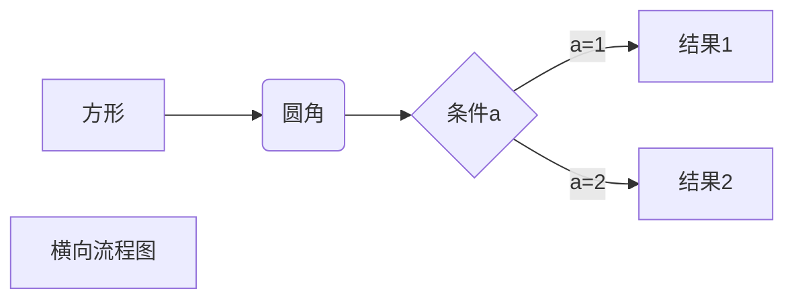
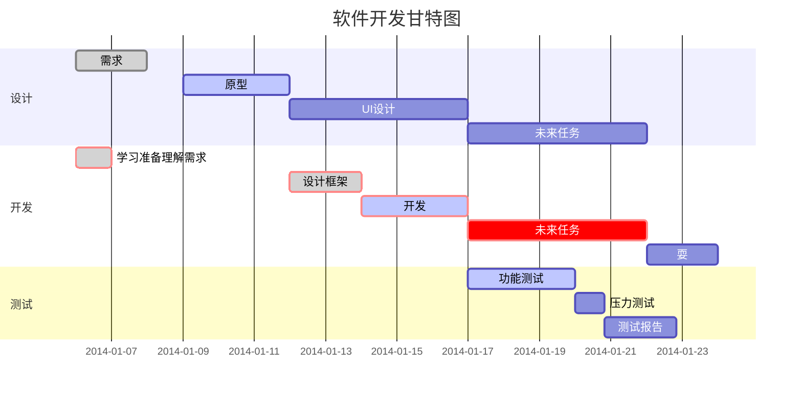

我展示的是一级标题
=================
# 我展示的是一级标题
## 我展示的是二级标题
我展示的是二级标题
----------------  
我这是一个段落  
你不信吧

我偏偏这  
*斜体文本*  
_xietiwenben_  
**粗体文本**  
***粗斜体文本***  
___粗斜体文本___  
***
* * *
*****
~~这是一个删除线~~  

<u>这是一个下划线</u>  

创建脚注格式类似这样[^Simon]
[^Simon]:这是王学孟

* 第一项
* 第二项
* 第三项

1. 第一项
2. 第二项
3. 第三项
4. 第四项
5. 第五项  
    - 规划法规及  
6. 骨灰盒

>区块引用  
>菜鸟教程  
>我是王学孟  
>>第二趟  
>>>第三趟  

>区块中使用列表
>1. 第一项
>2. 第二项
>+ 第一项
>+ 第二项

* 菜鸟教程
    > 三国演义  
    >骈拇
* 马蹄  

`cout`函数  
```javascript
$(document).ready(function () {
    alert('RUNOOB');
});
```
```bash
$git branch
$git status

```bash
$ cd ~/Developer/easynm/next-cloud
$ cp .env.example .env
$ docker-compose up -d
$ docker inspect next-easynm_postgres_1 | grep IPAddress

"SecondaryIPAddresses": null,
            "IPAddress": "",
                    "IPAddress": "172.30.0.2",
```

这是一个[百度](https://www.baidu.com)的链接

通过设置一个变量来设置连接用 1 作为变量[Google][1]  
  [1]: http://www.google.com/    
这个链接用 1 作为网址变量 [Google][1]
这个链接用 runoob 作为网址变量 [Runoob][runoob]
然后在文档的结尾为变量赋值（网址）

  [1]: http://www.google.com/
  [runoob]: http://www.runoob.com/  

  


| 表头 | 表头 |
| ---- | ---- |
| danyuange | danyuange |
| danyuange | danyuange |

  


  



st=>start: 开始  
e=>end: 结束
op1=>operation: 新品开发流程
op2=>operation: 产品需求提出
op3=>operation: 产品试用 负责人：吴xx
op4=>operation: 包装
op5=>parallel: 继续讨论
op6=>operation: 讨论
cond=>condition: 确认？

st->op1->op2->op3->cond
cond(yes)->op4->e
cond(no)->op6->e


  

```flow
st=>start: 页面加载
e=>end: End:>http://www.google.com
op1=>operation: get_hotel_ids|past
op2=>operation: get_proxy|current
sub1=>subroutine: get_proxy|current
op3=>operation: save_comment|current
op4=>operation: set_sentiment|current
op5=>operation: set_record|current

cond1=>condition: ids_remain空?
cond2=>condition: proxy_list空?
cond3=>condition: ids_got空?
cond4=>condition: 爬取成功??
cond5=>condition: ids_remain空?

io1=>inputoutput: ids-remain
io2=>inputoutput: proxy_list
io3=>inputoutput: ids-got

st->op1(right)->io1->cond1
cond1(yes)->sub1->io2->cond2
cond2(no)->op3
cond2(yes)->sub1
cond1(no)->op3->cond4
cond4(yes)->io3->cond3
cond4(no)->io1
cond3(no)->op4
cond3(yes, right)->cond5
cond5(yes)->op5
cond5(no)->cond3
op5->e

```  


